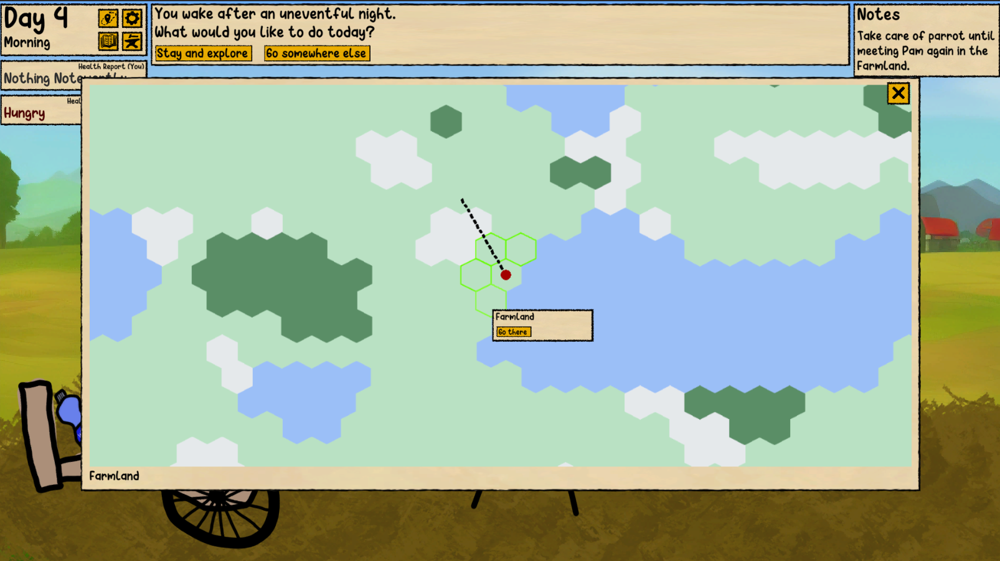

# About
This is a game about surviving on the road after the collapse of civilization as we know it. It's just you and your handcart. Every day you'll encounter challenges that you have to deal with somehow. Can you give this story a happy end?

The game is a basically a Point & Click where each day you'll encounter a random event. You always carry your handcart with you that can contain a couple of items that you can find, interact with or use during events. Fight off hunger, thirst, injuries, infections and other threats and try to reach one (out of many) happy ends. The game is supposed be quite diverse which might lead to it not always being fair. The art style is extremely basic/bad due to the fact that I draw everything myself and my drawing skills resemble those of an 8-year-old.

Keep Wandering takes inspiration from games like 60 Seconds (basic concept), Rimworld (health system) and many old-school flash games. 

# Screenshots
  

  

  

